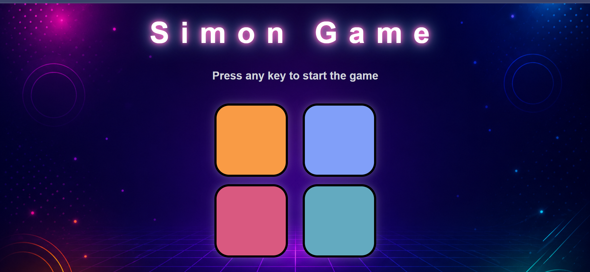

# Simon Game 🎮

A fun memory-based Simon Game built using **HTML, CSS, and JavaScript**. The game generates a sequence of colors, and the player must repeat the sequence correctly to advance to the next level.

## 🚀 Features

* Random color sequence generation
* Increasing difficulty with each level
* Visual animations for game and user clicks
* Score tracking
* High score tracking
* Responsive and attractive UI
* Game-over feedback with restart option

## 🛠️ Technologies Used

* HTML5
* CSS3
* JavaScript (DOM Manipulation & Event Handling)

## 🎯 How to Play

1. Press any key to start the game.
2. Watch the highlighted color carefully.
3. Click the color in the correct sequence.
4. Each level adds a new color to the sequence.
5. Repeat the entire sequence correctly to move to the next level.
6. The game ends if you click the wrong color.
7. Try to beat your highest score!

## 📂 Project Structure

```text
Simon-Game/
│
├── index.html
├── style.css
├── app.js
├── bg.png
└── README.md
```

## 🧠 Concepts Practiced

* DOM Manipulation
* Event Listeners
* Arrays
* Functions
* Conditional Statements
* Timers (`setTimeout`)
* Random Number Generation
* CSS Animations and Effects

## 📸 Preview

## 📸 Preview



## 🔮 Future Improvements

* Sound effects for each button
* Mobile touch support
* Difficulty modes
* Leaderboard system
* Better animations and transitions

## 👩‍💻 Author

Ritika Soni

Built as a JavaScript learning project to strengthen DOM manipulation and event handling concepts.
